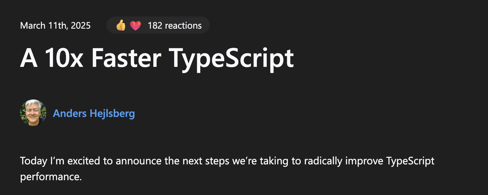

# tsgoを触ってみて得た学び

<div class="pt-8">
  <div class="text-xl opacity-90">
    かるカン
  </div>
</div>

---
transition: slide-left
---

# 自己紹介

<div class="grid grid-cols-2 gap-8 mt-24">

<div class="flex justify-center items-center">

</div>

<div>

<h3>👋 かるカン</h3>

- **X (Twitter)**: @karukan013L23
- フロントエンドエンジニア
- 最近はTypeScript/Reactを書いてます
- コーヒーが好き

</div>

</div>

---
transition: slide-left
layout: center
class: text-center
---

TSKaigiのとあるセッションにて

<div class="text-center">
<h1 class="text-6xl mb-8">
tsgo、触ってみましたか？
</h1>

<div v-click class="text-2xl mt-12">
<div class="flex items-center justify-center mb-4">
<span>・・・触ってないです</span>
</div>

</div>
</div>

---
transition: slide-left
---

<div class="text-center mt-32">

<div class="flex items-center justify-center mb-4">
<h1>というわけで、触ってみた</h1>
</div>

</div>

---
transition: slide-left
---

# typescript-go とは？

<div class="grid grid-cols-2 gap-8 mt-6">

<div>
TypeScriptをGoで実装し直したバージョン

- **Strada**: v6まで（従来のTS）
- <span>**Corsa**: v7以降（Go版のTS）</span>
<div v-click class="border-2 border-red-500 px-2 py-1 rounded inline-block mt-1 ml-8">
  <strong>↑</strong> 今回試したのはCorsa
</div>
</div>

<div v-click>
現在はプレビュー版として一部機能を提供

- **LSP**
  - 既存のts-serverからの移行
  - VSCode向けに拡張機能が提供
  - importの補完などまだ一部動作しない
  - リファクタリング機能でAI統合を検討中

- **型チェック**
  - `tsgo --noEmit` で型チェックのみ実行
  - ↑これを試しに触ってみた

</div>

</div>

---
transition: slide-left
---

# tsgo、何が嬉しい？

<div v-click>

- パフォーマンスの向上
  - Go移植によるシングルスレッド性能の向上
    - 3.5 faster!
  - 並列化
    - 2.5〜3？ faster!

</div>

<div v-click>

- コンパイルはesbuildやSWCを使用することで高速化することができるが、型チェックはtscしかできない
  - 開発体験の改善
  - 特にCIに組み込んでいる場合は、かなり恩恵を得られそう

</div>

---
transition: slide-left
---

# 本当か🤔

<div class="flex justify-center mt-8">

</div>


---
transition: slide-left
---

# 実際に試してみた
<div>tscとtsgoを実行してパフォーマンスを比較してみる</div>

```bash
# TypeScriptのプレビュー版をインストール
npm install -D @typescript/native-preview
# tscを実行
# オプションを追加して、型チェックのみ実行・コンパイル関連の情報を出力
npx tsc -p ./src/tsconfig.json --noEmit --extendedDiagnostics
# tsgoを実行
# オプションを追加して、型チェックのみ実行・コンパイル関連の情報を出力
npx tsgo -p ./src/tsconfig.json --noEmit --extendedDiagnostics
```

---
transition: slide-left
---

## 小規模プロジェクト (ポモドーロタイマー)

<div class="grid grid-cols-2 gap-8 mt-6">

<div>
<h4>tsc</h4>

```bash
Files: 789
Lines: 190,287
Total time: 2.23s
```

</div>

<div>
<h4>ts-go</h4>

```bash
Files: 789
Lines: 190,287
Total time: 0.710s
```

</div>

</div>

<div class="text-center mt-8">
<div v-click class="text-4xl font-bold text-green-600">3.14x faster!</div>
</div>

---
transition: slide-left
---

# 大規模プロジェクト (VSCode)

<div class="grid grid-cols-2 gap-8 mt-6">

<div>
<h4>tsc</h4>

```bash
Files: 5,109
Lines: 1,604,791
Check time: 40.36s
Total time: 47.22s
```

</div>

<div>
<h4>ts-go</h4>

```bash
Files: 5,109
Lines: 1,604,791
Check time: 4.416s
Total time: 5.571s
```

</div>

</div>

<div class="text-center mt-8">
<div v-click class="text-4xl font-bold text-green-600">8.47x faster!</div>
</div>

<div v-click class="mt-4 p-3 bg-blue-900 text-white border-l-4 border-blue-400 rounded animate-fade-in">
💡 大規模プロジェクトほどパフォーマンス改善が顕著
</div>

<style>
@keyframes fade-in {
  from {
    opacity: 0;
    transform: translateY(20px);
  }
  to {
    opacity: 1;
    transform: translateY(0);
  }
}

.animate-fade-in {
  animation: fade-in 0.8s ease-out;
}
</style>

---
transition: slide-left
---

# tsgoを触ってみて
- 型チェックについては、大方は既に正常に動く状態
  - ローカルで動かした分にはエラーは発生しなかった
  - いくつかIssueが上がっていた
- TypeScriptのコンパイラ関連の知見が深まった
  - 型チェック、コンパイラの関連性を改めて整理する機会になった
  - パフォーマンス関連情報を出力できるオプション`--extendedDiagnostics`
- 1次情報に触れることで得られる学び
  - 記事読んで満足するのではなく、自分でも触ってみることで実感が伴った学びになる
  - 関連領域についても調べるので、学習の機会としてもよかった

---
transition: slide-left
---


## typescript-goのリポジトリと公式記事を読んでみよう！

<br>

### 公式記事
- https://devblogs.microsoft.com/typescript/typescript-native-port/
- https://devblogs.microsoft.com/typescript/announcing-typescript-native-previews/

<br>

### typescript-goリポジトリ
- https://github.com/microsoft/typescript-go?tab=readme-ov-file#what-works-so-far
  - READMEに対応状況が記載されている

---
transition: slide-left
---

# ありがとうございました

<div class="mt-8">
<div class="text-lg opacity-75">ぜひtsgoを触ってみてください！</div>
</div>